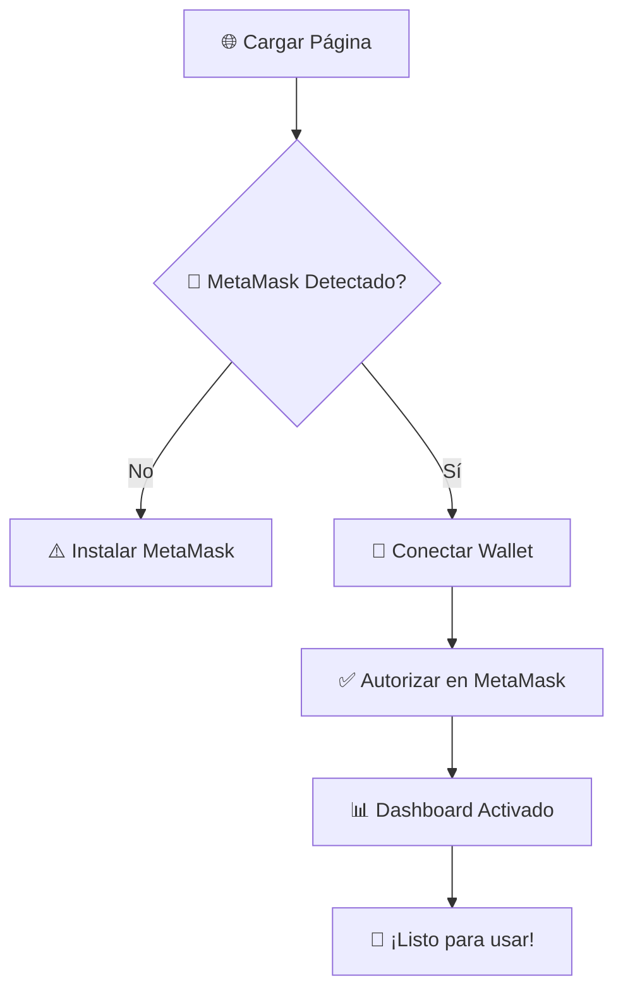

<div align="center">
  


# 🔗 **CryptoLink**
### *MetaMask Neural Interface*

<p align="center">
  <em>Una experiencia cyberpunk para conectar con el ecosistema Ethereum</em>
</p>

<p align="center">
  
  
  
</p>

<p align="center">
  
  
  
  
</p>

</div>

---

## 🌟 **Características Destacadas**

<table>
<tr>
<td width="33%" align="center">
  
  <h3>🔌 Conexión Instantánea</h3>
  <p>Conecta tu wallet MetaMask con un solo clic y experimenta la magia de Web3</p>
</td>
<td width="33%" align="center">
  
  <h3>🌐 Multi-Red</h3>
  <p>Soporte para Ethereum, Polygon, BSC, Testnets y más redes EVM</p>
</td>
<td width="33%" align="center">
  
  <h3>📊 Dashboard Avanzado</h3>
  <p>Visualiza balances, precios en tiempo real y gestiona transacciones</p>
</td>
</tr>
</table>

### ✨ **Funcionalidades Avanzadas**

- � **Interfaz Cyberpunk**: Diseño futurista con efectos visuales inmersivos
- 💰 **Precios en Tiempo Real**: Integración con CoinGecko API para cotizaciones actualizadas
- 🔄 **Auto-detección de Cambios**: Monitoreo automático de cambios de cuenta y red
- 📱 **Diseño Responsivo**: Optimizado para desktop, tablet y móvil
- ⚡ **Transacciones**: Envío de ETH con estimación de gas
- 📝 **Smart Contracts**: Interacción con contratos inteligentes
- ✍️ **Firmado de Mensajes**: Firma digital de mensajes personalizados
- � **Historial de Transacciones**: Seguimiento completo de operaciones
- 🎨 **Efectos Visuales**: Animaciones de partículas y efectos Matrix

---

## � **Inicio Rápido**

### **📋 Requisitos Previos**

- 🦊 [MetaMask](https://metamask.io/) instalado en tu navegador
- 🌐 Navegador moderno (Chrome, Firefox, Safari, Edge)
- 🔗 Conexión a internet estable

### **⚡ Instalación Rápida**

```bash
# 1. Clona el repositorio
git clone https://github.com/your-username/cryptolink-metamask.git

# 2. Navega al directorio
cd cryptolink-metamask

# 3. Abre con tu navegador favorito
# Opción A: Doble clic en index.html
# Opción B: Usar servidor local (recomendado)
```

### **🌐 Servidor Local (Recomendado)**

<details>
<summary><b>🐍 Python</b></summary>

```bash
# Python 3.x
python -m http.server 8000

# Python 2.x
python -m SimpleHTTPServer 8000
```
</details>

<details>
<summary><b>📦 Node.js</b></summary>

```bash
# Instalar http-server
npm install -g http-server

# Iniciar servidor
http-server -p 8000
```
</details>

<details>
<summary><b>🔥 PHP</b></summary>

```bash
php -S localhost:8000
```
</details>

<details>
<summary><b>🦀 Rust</b></summary>

```bash
# Instalar basic-http-server
cargo install basic-http-server

# Iniciar servidor
basic-http-server
```
</details>

Luego visita: **http://localhost:8000** 🚀

---

## 🎮 **Guía de Usuario**

<div align="center">
  
</div>

### **🔄 Flujo de Conexión**



### **🎯 Acciones Disponibles**

| Acción | Descripción | Estado |
|--------|-------------|--------|
| 🔌 **Conectar** | Establecer conexión con MetaMask | ✅ Activo |
| 💰 **Ver Balances** | Mostrar saldos en múltiples redes | ✅ Activo |
| 💸 **Enviar ETH** | Transferir Ethereum a otras direcciones | ✅ Activo |
| 📝 **Contratos** | Interactuar con Smart Contracts | ✅ Activo |
| ✍️ **Firmar** | Firmar mensajes personalizados | ✅ Activo |
| 📊 **Historial** | Ver transacciones anteriores | ✅ Activo |
| 🔄 **Cambiar Red** | Switching entre diferentes blockchains | ✅ Activo |

---

## 📁 **Arquitectura del Proyecto**

```
cryptolink-metamask/
├── 📄 index.html              # 🏠 Estructura principal
├── 🎨 styles-improved.css     # 💅 Estilos cyberpunk
├── ⚙️ script-improved.js      # 🧠 Lógica Web3
├── 📖 README.md               # 📚 Este archivo
└── 🗂️ .vscode/               # ⚡ Configuración VS Code
    └── settings.json
```

### **🧩 Componentes Principales**

- **🎨 Sistema de Estilos**: CSS moderno con animaciones y efectos visuales
- **🔗 Integración Web3**: Comunicación directa con MetaMask
- **📊 Gestión de Estado**: Manejo de cuentas, redes y transacciones
- **🌐 API Externa**: Integración con CoinGecko para precios
- **💫 Efectos Visuales**: Partículas animadas y temas cyberpunk

---

## 🌐 **Redes Soportadas**

<div align="center">

| 🌍 Red | 💎 Token | 🔗 Chain ID | 📊 Estado |
|--------|----------|-------------|-----------|
|  **Ethereum** | ETH | `0x1` | ✅ Activo |
|  **Polygon** | MATIC | `0x89` | ✅ Activo |
|  **BSC** | BNB | `0x38` | ✅ Activo |
| 🧪 **Sepolia** | SepoliaETH | `0xaa36a7` | ✅ Testnet |
| 🔥 **Holesky** | HoleskyETH | `0x4268` | ✅ Testnet |
| 🌐 **Goerli** | GoerliETH | `0x5` | ⚠️ Deprecado |

</div>

---

## 🛠️ **Desarrollo**

### **🔧 Variables de Configuración**

```javascript
// 🌐 URLs de RPC
const RPC_URLS = {
  ethereum: 'https://mainnet.infura.io/v3/YOUR_KEY',
  polygon: 'https://polygon-rpc.com',
  bsc: 'https://bsc-dataseed.binance.org'
};

// 💰 Símbolos para precios
const PRICE_SYMBOLS = {
  'ETH': 'ethereum',
  'MATIC': 'matic-network',
  'BNB': 'binancecoin'
};
```

### **🎨 Personalización de Temas**

```css
:root {
  --primary-color: #00ff41;    /* 💚 Verde Matrix */
  --secondary-color: #0066ff;  /* 🔵 Azul Cyber */
  --accent-color: #ff0080;     /* 💖 Rosa Neon */
  --dark-bg: #0a0a0a;         /* ⚫ Fondo Oscuro */
}
```

---

## � **Solución de Problemas**

<details>
<summary><b>🦊 MetaMask no se conecta</b></summary>

- ✅ Verifica que MetaMask esté instalado y actualizado
- 🔓 Asegúrate de que tu wallet esté desbloqueada
- 🔄 Refresca la página e intenta nuevamente
- 🌐 Verifica tu conexión a internet
</details>

<details>
<summary><b>💰 Saldos no se muestran</b></summary>

- ⏳ Espera unos segundos para la carga de datos
- 🌐 Verifica la conexión de red
- 🔄 Usa el botón de refrescar balances
- 🔗 Confirma que estés en la red correcta
</details>

<details>
<summary><b>⚡ Transacciones fallan</b></summary>

- 💰 Verifica que tengas saldo suficiente
- ⛽ Ajusta el precio del gas
- 🕒 Espera a que la red esté menos congestionada
- 📝 Revisa la dirección de destino
</details>

<details>
<summary><b>🎨 Problemas visuales</b></summary>

- 🌐 Asegúrate de usar un navegador moderno
- 🔄 Limpia la caché del navegador
- 📱 Verifica la compatibilidad móvil
- 🎮 Actualiza los drivers gráficos
</details>

---

## 🤝 **Contribuir**

<div align="center">
  
### **¡Tu contribución es bienvenida!** 🎉


</div>

### **🌟 Cómo Contribuir**

1. 🍴 **Fork** el repositorio
2. 🌿 Crea una **rama** para tu feature (`git checkout -b feature/amazing-feature`)
3. ✨ **Desarrolla** tu mejora
4. 📝 **Commit** tus cambios (`git commit -m 'Add amazing feature'`)
5. 🚀 **Push** a la rama (`git push origin feature/amazing-feature`)
6. 🎯 Abre un **Pull Request**

### **💡 Ideas para Contribuir**

- 🆕 Nuevas redes blockchain
- 🎨 Mejoras en UI/UX
- 🔧 Optimizaciones de rendimiento
- 📚 Documentación adicional
- 🐛 Corrección de bugs
- 🌍 Traducciones

---

## 📚 **Recursos y Referencias**

<div align="center">

| 📖 Recurso | 🔗 Enlace | 📝 Descripción |
|-----------|-----------|----------------|
| 🦊 **MetaMask Docs** | [docs.metamask.io](https://docs.metamask.io/) | Documentación oficial |
| ⚡ **Ethereum.org** | [ethereum.org/developers](https://ethereum.org/developers/) | Guías de desarrollo |
| 🔗 **EIP-1193** | [eips.ethereum.org](https://eips.ethereum.org/EIPS/eip-1193) | Estándar Provider API |
| 💰 **CoinGecko API** | [coingecko.com/api](https://www.coingecko.com/en/api) | API de precios crypto |
| 🎨 **Web3.js** | [web3js.org](https://web3js.org/) | Biblioteca JavaScript |

</div>

---

## 📄 **Licencia**

<div align="center">

Este proyecto está bajo la **Licencia MIT** 📜

[](https://opensource.org/licenses/MIT)

*Consulta el archivo [LICENSE](LICENSE) para más detalles*

</div>

---

<div align="center">

### **🚀 ¡Hecho con ❤️ para la comunidad Web3!**


**⭐ Si te gusta este proyecto, ¡dale una estrella!**

<p>
  <a href="https://twitter.com/intent/tweet?text=Check%20out%20CryptoLink%20-%20An%20amazing%20MetaMask%20interface!&url=https://github.com/your-username/cryptolink-metamask">
    
  </a>
</p>

---

*© 2025 CryptoLink Project. Construyendo el futuro de Web3, una conexión a la vez.* 🌟

</div>